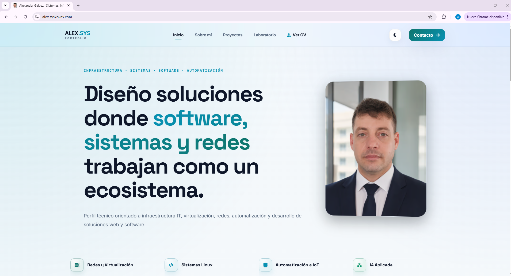

# Alex | Syskovex Portfolio Frontend

Frontend de mi portfolio personal desarrollado con **React + Vite**, consumiendo contenido dinámico desde una API en **Laravel**. Este proyecto está orientado a mostrar mi perfil técnico, proyectos, laboratorio, certificaciones y contacto dentro de una arquitectura desacoplada frontend/backend.

## Demo

- Frontend: [https://alex.syskovex.com](https://alex.syskovex.com)
- API: [https://portfolio-api.syskovex.com](https://portfolio-api.syskovex.com)

## Descripción

Este repositorio contiene la parte frontend de mi portfolio profesional. La aplicación obtiene el contenido principal desde una API Laravel externa y organiza la interfaz en páginas, hooks, servicios y componentes reutilizables para mantener una base limpia, escalable y fácil de mantener.

La web está desplegada bajo dominio propio en Cloudflare, mientras que la API está desplegada en Render también con dominio propio. Cloudflare Pages permite asociar dominios personalizados a proyectos estáticos, y Render ofrece soporte de dominios propios con TLS y redirección HTTPS automática para servicios desplegados. [web:61][web:78]

## Capturas

### Home


> La home actual ya está integrada en la versión pública desplegada del portfolio. Las capturas de `Projects` y `Laboratory` se añadirán cuando esas secciones queden cerradas visual y funcionalmente. [web:101][web:123]

## Características

- Frontend desacoplado de la API backend.
- Consumo de contenido dinámico desde Laravel.
- Navegación SPA con rutas públicas en español.
- Carga diferida por páginas con `lazy` y `Suspense`.
- Estructura modular por páginas, hooks, layout, servicios y componentes reutilizables.
- Configuración preparada para despliegue con dominio propio.
- Base pensada para seguir creciendo con nuevas secciones y contenido administrado desde backend. [web:99][web:115]

## Stack técnico

- React 19
- Vite 8
- React Router
- Axios
- Lucide React
- React Icons
- ESLint
- Stylelint

## Arquitectura

La aplicación sigue una arquitectura desacoplada:

- **Frontend**: React + Vite
- **Backend**: Laravel API
- **Despliegue del frontend**: Cloudflare con dominio propio
- **Despliegue del backend**: Render con dominio propio
- **Consumo de datos**: Axios centralizado + hooks por página

### Flujo general

```text
Usuario
  -> Frontend React/Vite
  -> services/api.js
  -> API Laravel
  -> respuesta JSON
  -> hooks/pages
  -> componentes / páginas
```

Esta separación ayuda a mantener el acceso a datos aislado de la presentación y facilita que el portfolio siga creciendo sin mezclar responsabilidades.

## URLs públicas

- Sitio público: `https://alex.syskovex.com`
- Backend base: `https://portfolio-api.syskovex.com`
- Base real usada por Axios: `https://portfolio-api.syskovex.com/api`

## Variables de entorno

El proyecto utiliza variables de entorno de Vite, por lo que deben llevar el prefijo `VITE_`. La guía oficial de Vite documenta que solo esas variables se exponen al cliente mediante `import.meta.env`. [web:49]

### `.env.example`

```env
VITE_API_URL=https://portfolio-api.syskovex.com
```

### Importante

No añadas `/api` al valor de `VITE_API_URL`, porque el proyecto ya lo concatena internamente en `src/services/api.js`.

Ejemplo correcto:

```env
VITE_API_URL=https://portfolio-api.syskovex.com
```

Ejemplo incorrecto:

```env
VITE_API_URL=https://portfolio-api.syskovex.com/api
```

## Cliente API

El acceso al backend está centralizado en `src/services/api.js`.

### Comportamiento actual

- Lee `VITE_API_URL`
- Elimina la barra final si existe
- Construye `API_BASE_URL` añadiendo `/api`
- Usa una instancia Axios común
- Aplica `timeout` de 10 segundos
- Define headers JSON
- Normaliza errores HTTP, de red y errores desconocidos

### Base del cliente

```js
const API_URL = (
  import.meta.env.VITE_API_URL || "http://localhost:8000"
).replace(/\/$/, "");
const API_BASE_URL = `${API_URL}/api`;
```

### Servicios expuestos

#### `portfolioService`

- `getHomeData()`
- `getAboutData()`
- `getProjects()`
- `getProjectDetail(slug)`

#### `laboratoriosRealesService`

- `getHome()`
- `getList()`
- `getDetail(slug)`

#### `contactService`

- `sendMessage(payload)`

## Rutas públicas

El proyecto usa `react-router` y define las rutas principales en `src/router/index.jsx`.

### Rutas actuales

- `/`
- `/sobre-mi`
- `/certificaciones`
- `/proyectos`
- `/proyectos/:slug`
- `/contacto`
- `/laboratorio`

Además, el router aplica:
- carga diferida con `lazy`
- `Suspense` por vista
- redirección de rutas desconocidas a `/`

## Carga diferida

Las páginas se cargan con `React.lazy()` y `Suspense`, lo que ayuda a reducir la carga inicial y a dividir mejor el bundle por rutas. Esa es una práctica habitual en aplicaciones React para mejorar rendimiento percibido y escalado del frontend. [web:30][web:83]

## Scroll behavior

En `App.jsx`, la app controla el scroll al navegar:

- si la navegación es `POP` (volver atrás), mantiene la posición previa;
- si es una navegación nueva (`PUSH`), mueve la ventana arriba del todo.

Ese detalle mejora bastante la experiencia al recorrer varias páginas del portfolio.

## Estructura del proyecto

```text
src/
  components/
    cards/
      LaboratoryCard.css
      LaboratoryCard.jsx
      ProjectCard.css
      ProjectCard.jsx

  hooks/
    core/
      useAsyncResource.js
    pages/
      useContactChat.js
      useLaboratoryHome.js
      usePortfolioAbout.js
      usePortfolioHome.js
      useProjectDetail.js
      useProjects.js
    usePageTitle.js
    usePortfolioData.js

  layout/
    navbar/
      Navbar.css
      Navbar.jsx
    sections/
      ContactPreview.jsx
      FeaturedLaboratory.jsx
      FeaturedProjects.css
      FeaturedProjects.jsx
      aboutPreview/
        AboutPreview.jsx
      heroSection/
        HeroSection.css
        HeroSection.jsx
    MainLayout.jsx

  modal/
    CvModal.css
    CvModal.jsx
    cvComponents/
      Avatar.jsx
      Avatar.module.css
      EducacionTecnologias.jsx
      EducacionTecnologias.module.css
      Especializacion.jsx
      Especializacion.module.css
      Experiencia.jsx
      Experiencia.module.css
      Footer.jsx
      Footer.module.css
      HeaderBanner.jsx
      HeaderBanner.module.css
      ProyectosIdiomas.jsx
      ProyectosIdiomas.module.css
      Sidebar.jsx
      Sidebar.module.css
      SobreMi.jsx
      SobreMi.module.css

  pages/
    about/
      About.css
      About.jsx
    certificaciones/
      Certificaciones.css
      Certificaciones.jsx
    contact/
      Contact.css
      Contact.jsx
    home/
      Home.jsx
    laboratory/
      Laboratory.css
      Laboratory.jsx
    projects/
      ProjectDetail.css
      ProjectDetail.jsx
      Projects.jsx

  router/
    index.jsx

  services/
    api.js

  style/
    GlobalCardsPages.css
    GlobalSections.css
    globals.css

  App.jsx
  main.jsx
```

## Organización por capas

- `pages/`: vistas principales.
- `layout/`: layout general, navbar y secciones compartidas.
- `components/`: piezas reutilizables de UI.
- `hooks/`: lógica desacoplada por página y utilidades comunes.
- `services/`: acceso centralizado a backend.
- `router/`: rutas y lazy loading.
- `modal/`: CV modular por bloques.
- `style/`: estilos globales y compartidos.

## Requisitos

Antes de ejecutar el proyecto necesitas:

- Node.js
- npm
- Backend Laravel accesible en local o remoto

## Instalación

```bash
npm install
```

## Desarrollo local

1. Configura el archivo `.env` a partir de `.env.example`
2. Levanta la API Laravel
3. Ejecuta el frontend

```bash
cp .env.example .env
npm install
npm run dev
```

En Windows PowerShell puedes crear `.env` manualmente si no usas `cp`.

## Scripts disponibles

```bash
npm run dev
npm run build
npm run preview
npm run lint
```

### Descripción

- `npm run dev`: inicia Vite en desarrollo.
- `npm run build`: genera la build de producción.
- `npm run preview`: previsualiza la build localmente.
- `npm run lint`: ejecuta ESLint.

La documentación de Vite también usa este flujo básico de `install -> dev -> build -> preview` en proyectos frontend. [web:30]

## Configuración de Vite

El proyecto tiene varias optimizaciones personalizadas en `vite.config.js`.

### Desarrollo

- `watch.usePolling: true`
- `interval: 100`

Esto ayuda a evitar problemas de detección de cambios en Windows.

### Producción

- separación de chunks para React y React DOM;
- separación de librerías pesadas de animación si aparecen;
- agrupación del resto de dependencias en `vendor`;
- análisis de bundle con `rollup-plugin-visualizer`;
- aumento del límite de advertencia de chunk a 1000 KB.

## Build de producción

```bash
npm run build
```

La salida final se genera en:

```txt
dist/
```

## Despliegue

### Frontend

El frontend está desplegado con dominio propio en Cloudflare. Cloudflare Pages permite conectar dominios y subdominios personalizados a los proyectos publicados desde el panel de Workers & Pages. [web:61]

### Backend

La API está desplegada en Render con dominio propio. Render gestiona certificados TLS, HTTPS automático y soporte para custom domains en servicios desplegados. [web:78]

## Assets públicos detectados

En `public/` y `dist/` ya se observan varios assets y archivos orientados a SEO y publicación:

- favicons múltiples
- `robots.txt`
- `sitemap.xml`
- `site.webmanifest`
- `og-image.jpg`
- imágenes optimizadas en AVIF y WebP
- `_headers`
- `_redirects`
- `llms.txt`

Eso muestra que el proyecto ya cuida bastante la parte de entrega, indexación y presentación pública.

## Estado actual

Actualmente el proyecto ya tiene operativas las bases del frontend público, la navegación principal, la integración con la API y la home visible en producción. Las secciones `Projects` y `Laboratory` siguen en evolución y se documentarán visualmente cuando queden cerradas a nivel funcional y visual. [web:101][web:123]

## Próximas mejoras

- Finalizar la sección de proyectos.
- Completar la sección de laboratorio.
- Añadir nuevas capturas cuando esas vistas estén terminadas.
- Seguir refinando rendimiento, estructura y experiencia visual.
- Mantener alineada la documentación del frontend con la evolución de la API. [web:99][web:100]

## Mejoras recomendadas para GitHub

Un README de calidad suele mejorar mucho si incluyes:
- una captura de la home;
- un GIF corto navegando entre páginas;
- una sección de características;
- una captura del análisis de bundle o arquitectura si quieres orientar el repo a perfil técnico.

Las guías de README de calidad suelen recomendar screenshots, GIFs, enlaces al deploy y una estructura clara por secciones. [web:74][web:77][web:79][web:83][web:85]

## Autor

**Alex / Syskovex**

- Frontend: [https://alex.syskovex.com](https://alex.syskovex.com)
- API: [https://portfolio-api.syskovex.com](https://portfolio-api.syskovex.com)